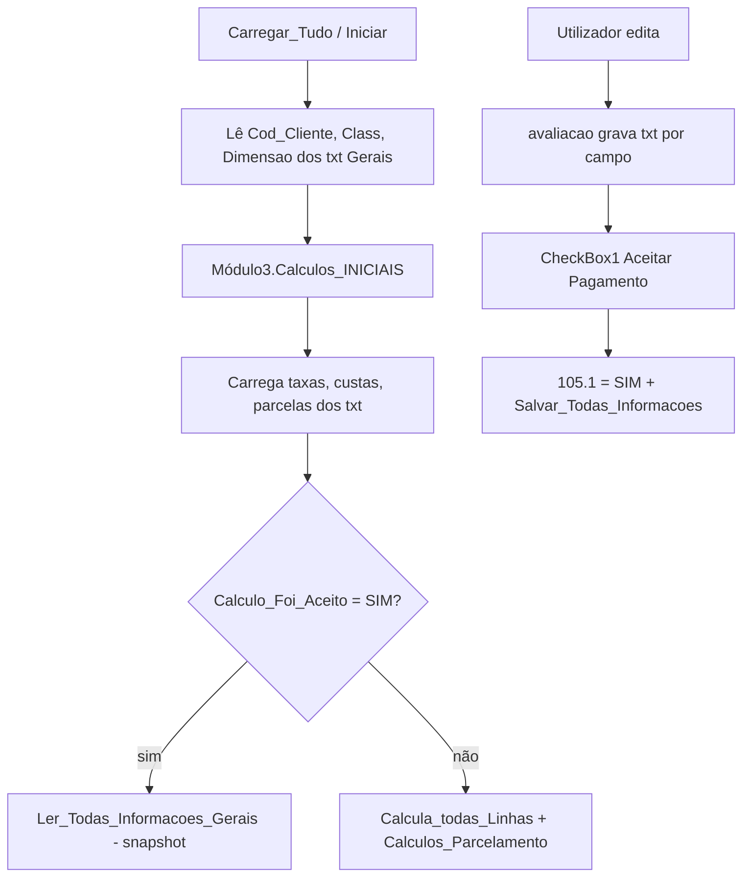

# Importação de cálculos a partir de txt (Dropbox)

Documento de análise das macros VBA (`Form_Cadastro_Debitos` + `Módulo2.avaliacao`) e do que já existe no repositório para montar `scripts/import-calculos-txt.mjs`.

## Onde ficam os ficheiros

| Repositório legado | Caminho |
|--------------------|---------|
| Formulário | `Formulario = "Taxas Condominiais"` → pasta **Calculos** |
| Leitura/gravação | `[Módulo2].Definir_File_Path` → `avaliacao` / `Ler_dados` / `CriarDados` |

Estrutura física (função `SubPasta` no Módulo2):

```
{Banco de Dados}/Calculos/{milhar}/{centena}/{nº_cliente}/{Nome_do_Txt}.txt
```

- **milhar**: `1000` se `codNum < 2000`, senão `2000`
- **centena**: regra VB (`0`, `100`, … `900`); cliente **728** usa sempre pasta **700**
- **nº_cliente**: número sem zeros (ex.: `728`, não `00000728`)
- **Nome_do_Txt**: chave composta (uma linha por ficheiro)

Exemplo real (cliente 728):

```
/Users/.../Dropbox/Banco de Dados/Calculos/1000/700/728/00000728.0.100.1.702.001.txt
```

Outros formulários no mesmo módulo (não são Calculos):

| Formulario | Pasta |
|----------|-------|
| `Gerais` | `Banco de Dados/Gerais/...` |
| `Honorarios` | `Banco de Dados/Honorários/...` |
| `Proc` | `Banco de Dados/Proc/...` |
| `HC` | histórico de consultas |

## Chaves do formulário

| Variável VBA | Significado | No nome do txt |
|--------------|-------------|----------------|
| `Cod_Cliente` | 8 dígitos | prefixo `00000728` |
| `Dimensao` | cenário (0, 1, 2…) | 2.º segmento |
| `Class_do_Processo` | processo no Excel (2 dígitos na UI) | no disco costuma ser o **nº interno** (ex.: `702`, `1573`) |
| `N_da_Parcela` / Label300+ | linha de título `001`…`999` | último segmento quando existe |

Padrão geral do nome:

```
{cod8}.{dimensao}.{tipo}.1.{numeroProcesso}[.{linhaOuParcela}].txt
```

Honorários (outra aba / outro Formulario) usam outro meio:

```
{cod8}.{dimensao}.01|02|03|04.{parcelaFormatada00}.{numeroProcesso}.txt
```

## Mapa tipo → campo (macros coladas)

### Configuração da rodada (por processo, sem linha)

| Tipo | Campo UI / variável |
|------|---------------------|
| `.89.1.{proc}` | Taxa juros % (`TextBox5320`) |
| `.94.1.{proc}` | Taxa multa % |
| `.95.1.{proc}` | Taxa honorários % |
| `.96.1.{proc}` | `FIXO` ou `VARIAVEL` |
| `.128.1.{proc}.001` | Índice (INPC, IGPM, SELIC, NENHUM, POUPANÇA, IPCA-E, TR, CDI) |
| `.105.1.{proc}` | Cálculo aceito (`SIM` / vazio) — **parcelamento aceito** |
| `.110.1.{proc}` | Quantidade de parcelas |
| `.111.1.{proc}` | Data do cálculo |
| `.114.1.{proc}` | Valor final da parcela |
| `.115.1.{proc}` | Valor total pago após parcelamento |
| `.116.1.{proc}` | Honorários por parcela (consolidado) |
| `.117.1.{proc}` | Custas por parcela |
| `.118.1.{proc}` | Custas após parcelamento |
| `.119.1.{proc}` | Valor final atualizado taxas |
| `.120.1.{proc}` | Valor final atualizado custas |
| `.121.1.{proc}` | Valor total a pagar |
| `.122.1.{proc}` | Taxa juros parcelamento |
| `.104.1.{proc}.002` | Honorários adv total (snapshot, com aceite manual) |

### Por linha de débito (`{NNN}` = Label300 = linha do título)

| Tipo | Campo |
|------|-------|
| `.100.1.{proc}.{NNN}` | Vencimento taxa condominial |
| `.101.1.{proc}.{NNN}` | Valor do título |
| `.104.1.{proc}.{NNN}` | Atualização monetária (linha) |
| `.106.1.{proc}.{NNN}` | Juros (linha) |
| `.107.1.{proc}.{NNN}` | Multa (linha) |
| `.108.1.{proc}.{NNN}` | Honorários (linha taxa) |
| `.109.1.{proc}.{NNN}` | Descrição numérica (ComboBox) |
| `.133.1.{proc}.{NNN}` | Descrição textual |

### Custas judiciais (linhas 1–20 fixas no form)

| Tipo | Campo |
|------|-------|
| `.102.1.{proc}.{NNN}` | Data pagamento custas |
| `.103.1.{proc}.{NNN}` | Valor custas |
| `.112.1.{proc}.{NNN}` | Atualização monetária custas |
| `.113.1.{proc}.{NNN}` | Juros custas |

### Parcelamento (`CheckBox2` = edição manual após aceite)

| Tipo | Campo |
|------|-------|
| `.123.1.{proc}.{NNN}` | Vencimento parcela |
| `.124.1.{proc}.{NNN}` | Valor parcela |
| `.125.1.{proc}.{NNN}` | Honorários na parcela |
| `.139.1.{proc}.{NNN}` | Data pagamento parcela |
| `.140.1.{proc}.{NNN}` | Observação parcela |

### Datas especiais por linha (`Form_DatasEspeciais`)

| Tipo | Campo |
|------|-------|
| `.141.1.{proc}.{NNN}` | Data inicial atualização |
| `.142.1.{proc}.{NNN}` | Data inicial juros |
| `.143.1.{proc}.{NNN}` | Taxa juros especial da linha |
| `.145.1.{proc}.{NNN}` | Data final atualização |
| `.146.1.{proc}.{NNN}` | Data final juros |

### Gerais da dimensão (sem processo no meio)

| Tipo | Campo |
|------|-------|
| `{cod}.{dim}.129.1` | Taxa honorários % (form geral) |
| `{cod}.{dim}.130.1` | FIXO/VARIAVEL geral |
| `{cod}.{dim}.131.1` | Taxa juros geral |
| `{cod}.{dim}.132.1` | Taxa multa geral |
| `{cod}.{dim}.149.1` | Periodicidade (MENSAL, QUINZENAL, …) |

### Cliente / recibos

| Tipo | Campo |
|------|-------|
| `{cod}.141` | Lista de recibos emitidos (texto concatenado) |
| `6.1` | Inf. pagamento (Gerais) |

## Fluxo do formulário (o que o script deve espelhar)



Para importação **sem recalcular** no Node (fase 1):

1. Agrupar ficheiros por `{cod8}|{dim}|{proc}`.
2. Se existir `.105.1.{proc}` = `SIM`, tratar como **rodada aceita** e importar valores já gravados (linhas + totais + parcelas).
3. Se não aceito, importar só **entradas brutas** (vencimento, valor, taxas, índice) e deixar a UI/API recalcular — ou chamar motor legado (`legacy-calculo-vba-spec.md`).

## API alvo (já usada pelos imports de planilha)

```
PUT /api/calculos/rodadas/{codigoCliente8}/{numeroProcesso}/{dimensao}
```

Payload mínimo hoje nos scripts de planilha:

```json
{
  "parcelamentoAceito": true,
  "parcelas": [ { "numero", "dataVencimento", "dataPagamento", "valorParcela", "honorariosParcela", "observacao" } ],
  "debitos": [ { "posicao", "chaveCodigo", "chaveDescricao", "dataVencimento", "dataPagamento", "valor", ... } ]
}
```

A tela `Calculos.jsx` persiste estrutura mais rica (`titulos`, `cabecalho`, taxas, índice). O import txt pode evoluir em fases: primeiro alinhar ao PUT da planilha; depois expandir para o JSON completo da UI.

## Código já existente no repo

| Ficheiro | Papel |
|----------|-------|
| `docs/legacy-calculo-vba-spec.md` | Motor de cálculo TS (equivalente Módulo3) |
| `docs/legacy-calculo-vba-review.md` | Pegadinhas VBA (arredondamento, BrCond, aceite) |
| `scripts/import-calculos-planilha.mjs` | PUT rodada a partir de XLS |
| `scripts/lib/gerais-fase-processo-txt.mjs` | `resolverBaseBancoDados()` |
| `scripts/lib/historico-local-txt-paths.mjs` | Centena/milhar/pasta cliente |

**Não existia** leitor de `Calculos/*.txt` — ver `scripts/lib/calculos-dropbox-txt.mjs` e `scripts/import-calculos-txt.mjs`.

## Macros referenciadas mas não coladas (pedir se precisar)

- `Módulo3`: `Calculos_INICIAIS`, `Calculo_Linha_Taxas`, `Calculos_Parcelamento`, `Somar_Taxas`, `CarregarTaxas...`
- `Módulo1`: `Aceitar_Pagamento`, `DesAceitar_Pagamento`
- `Módulo17`: `Excluir_Informacoes_de_Parcelamento`
- `Módulo7`: `Ler_Honorarios`
- Índices: `Atualizacao_Monet`, `Calcula_Juros`, `Calcula_Juros_BrCond`, `Calcula_Multa`, `Calcula_Honorarios`

## Próximos passos do script

1. `--dry-run`: listar rodadas `{cod}|{proc}|{dim}`, contagem por tipo, flag `105.1=SIM`.
2. `--cliente=N --aplicar`: montar payload e `PUT` (como `import-calculos-planilha.mjs`).
3. Validar `numeroProcesso` na API (mesmo mapa que `import-real` / GET processos por cliente).
4. Opcional: recálculo legado antes do PUT quando não aceito.
